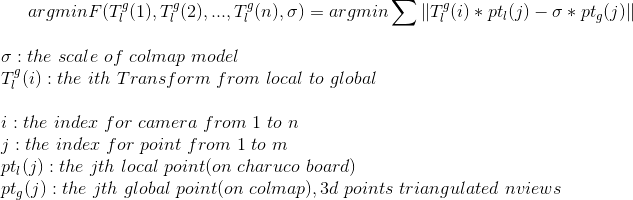
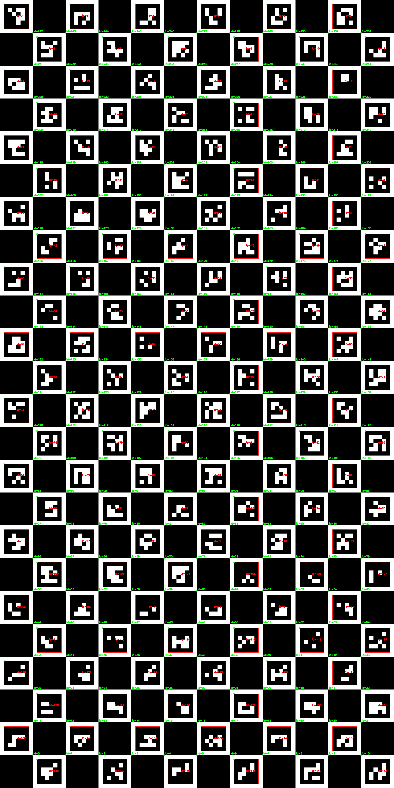

# 算法说明

T和sigma的初始值,可以通过已经三角化的全局三维点,做SVD得到平面确定,具体见scale_restoration.py的sim3_transform函数.
整体优化见scale_restoration.py的optimize_n_poses_and_scale.

# charuco说明

我们用A1大小的charuco板,辅助colmap model的尺度恢复;

如下图所示,我们用**aruco.DICT_4X4_1000**生成24 * 12的charuco board,然后把它分割成6个8 * 6的board;

注意:

- 在单独识别8 * 6的board的时候,构建board的参数依然要用24 * 12的参数, 把它当成只有一部分可视的完整board用, 不然只能检测marker, 不能检测charuco corner;
- marker id是较小的二进制码的id, 直角角点, 像素精度相对较低;
- charuco id是黑白格角点的id, 十字角点, 像素精度相对更高;
- marker id从左上角开始,从左往右/从上往下数;
- charuco id从左下角开始,从左往右/从下往上数;

